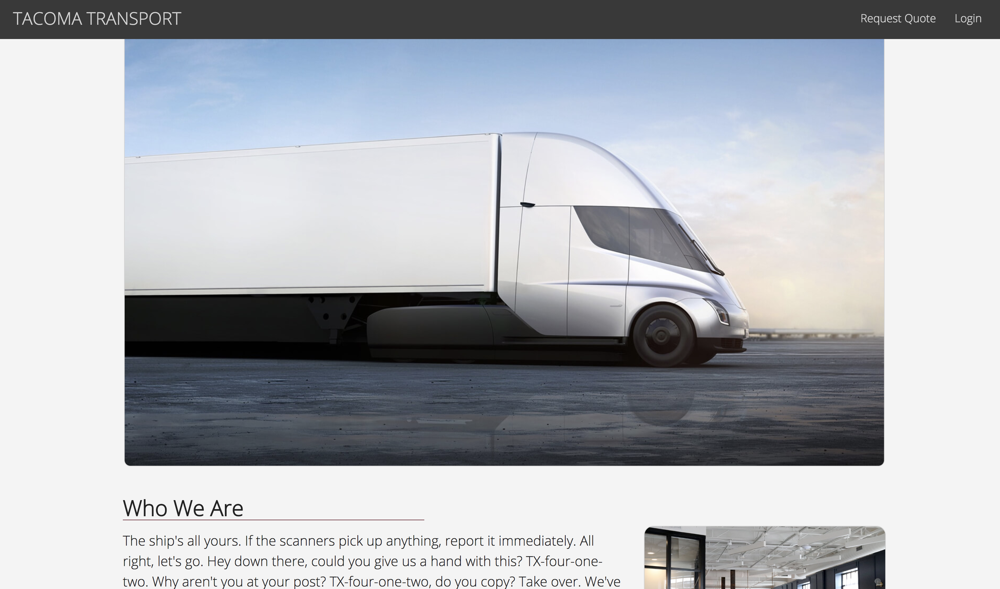
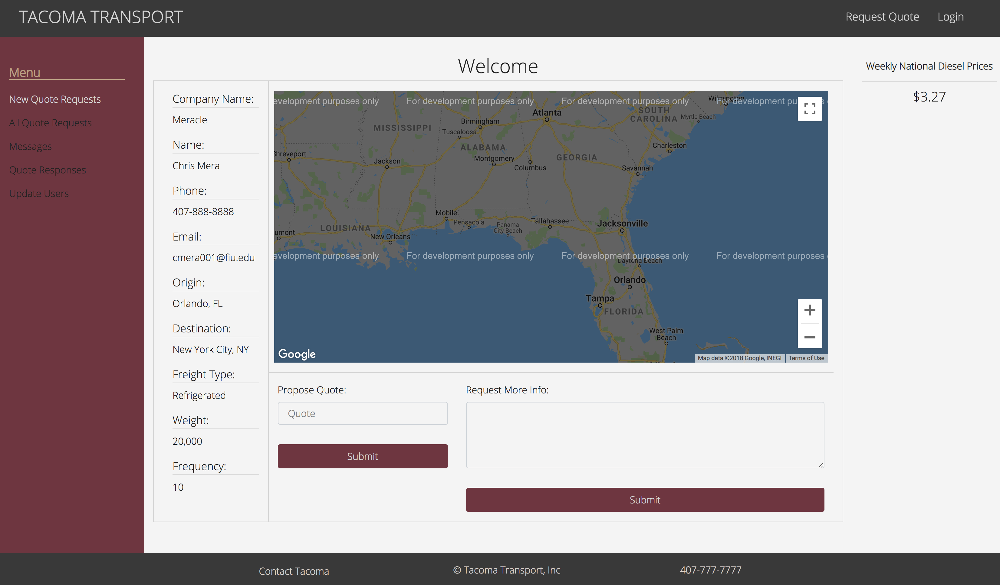

# Tacoma Transport Business Application

## Provides Online Presence
This project provides a company with an online presence to provide information to potential customers. Additionally, this web application allows for potential customers to request a transportation quote. The site administrator is able to login and see quote requests and all pertinent information related to said requests.

## Structure and Tech Used
* MongoDB
* Express Router
* React.js
* Node.js 
* Single Page Web Application

Link to deployed project: https://warm-waters-74694.herokuapp.com/

